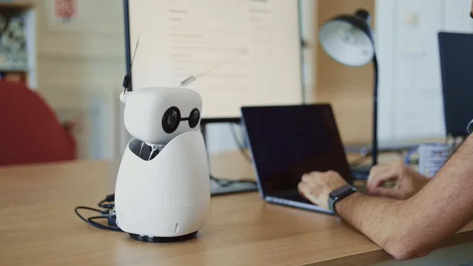
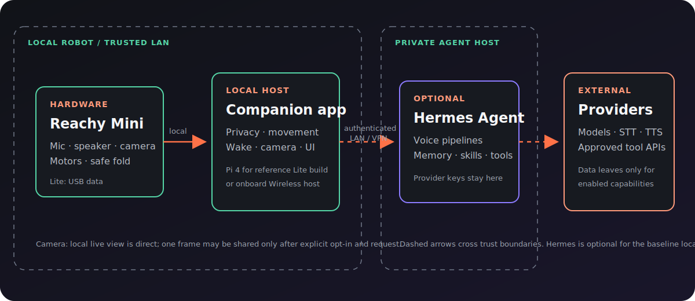
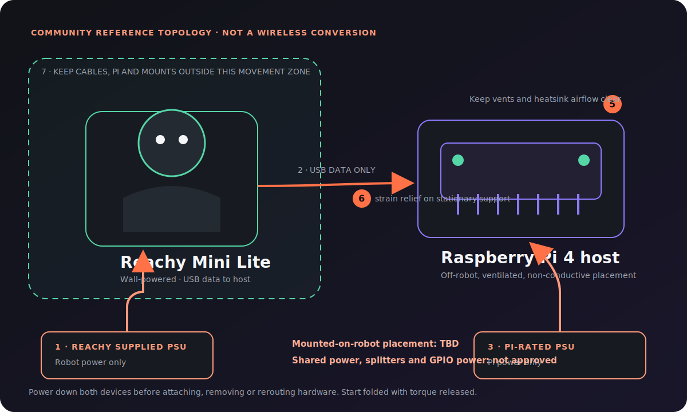
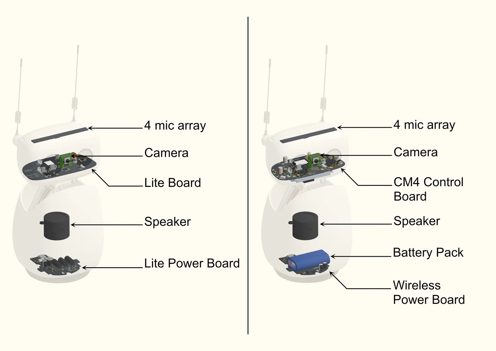
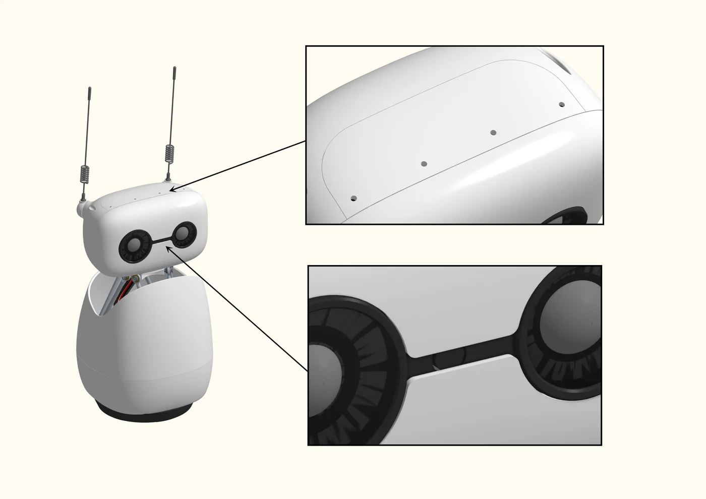
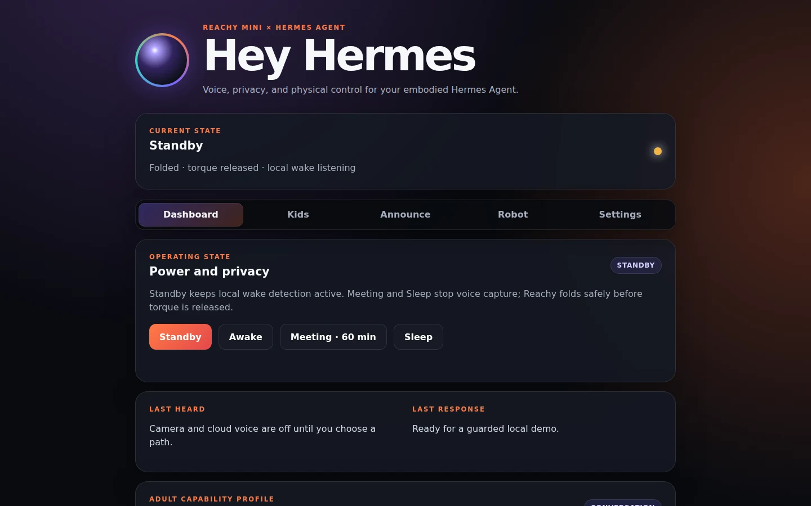
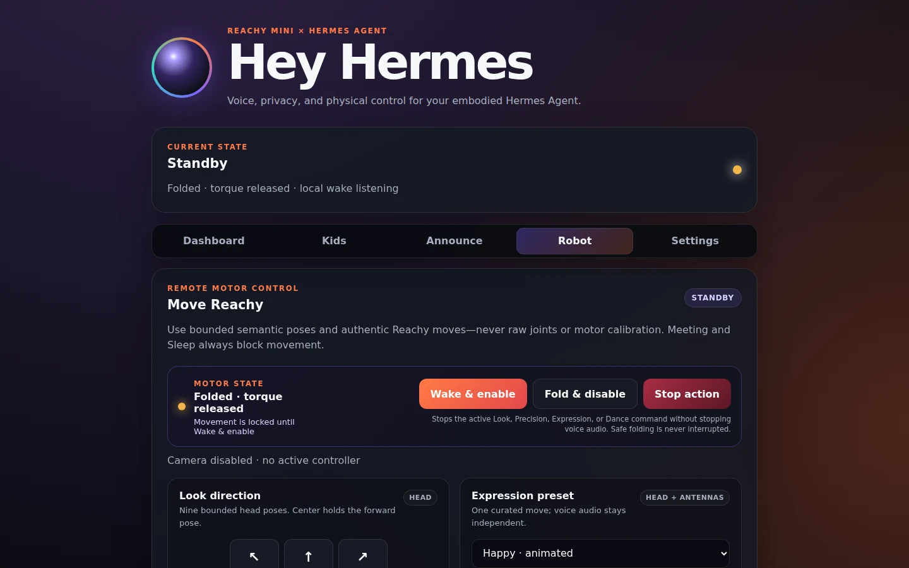

# Reachy Mini Hermes

An extensible, all-in-one companion and control app for Reachy Mini: local wake phrases, guarded movement, visible privacy states, opt-in camera controls, announcements, supervised Kids experiences and optional Sony controller support. Connect [Hermes Agent](https://github.com/NousResearch/hermes-agent) when you want voice pipelines, memory, skills and tools; it is the reference agent backend, not a prerequisite for understanding the local control surface.

[**Explore the app page ↗**](https://huggingface.co/spaces/Timbo89/reachy_mini_hermes) · [**Lite + Raspberry Pi 4 guide**](docs/lite-raspberry-pi-4.md) · [**Privacy and security**](SECURITY.md) · [**Operations and troubleshooting**](OPERATIONS.md)



*Actual Reachy Mini. Official Pollen Robotics source, converted to a static metadata-free WebP under Apache-2.0. [Image credits and immutable sources](docs/IMAGE_CREDITS.md).*

> **Status: early alpha.** Automated, bridge, network, camera, deployment and physical power-state checks have passed on Tim's reference Reachy Mini Lite + Raspberry Pi 4 setup. This is not a production-readiness or broad hardware-compatibility claim. Every installation still needs the documented physical, spoken wake-word, acoustic barge-in, camera/privacy and safe-fold acceptance checks.

## What can I expect?

1. **Bring supported hardware.** Use Reachy Mini Wireless, or a Lite connected to a computer. Tim's self-built Lite + Pi 4 arrangement is documented as a community adaptation—not an official Wireless conversion.
2. **Start locally and safely.** The browser UI exposes Standby, Awake, Meeting and Sleep; guarded wake/fold; bounded movement; Stop; announcements; and opt-in camera controls. Meeting and Sleep stop microphone capture and wake detection. Camera sharing is off by default.
3. **Try the short demo.** With clear space around Reachy, open the Dashboard, confirm folded Standby and released torque, wake from the Robot tab, try one bounded look, press Stop, return to Standby, and confirm fold-before-torque-off. Only then enable one camera or voice path at a time.
4. **Add Hermes when wanted.** A private authenticated bridge enables speech, provider routing, personal memory, skills and progressively gated tools while keeping provider credentials on the Hermes host.
5. **Treat advanced features as gated.** Kids Mode requires adult supervision. Agent Mode uses empty-by-default allowlists, reversible actions, and exact phone approval for consequential work. Bluetooth controller management remains Wireless-only and still needs final physical controller acceptance on that hardware.

## Capability and setup matrix

**Legend:** ✅ verified on the named reference setup · ◐ implemented/automated but requires per-install or final hardware acceptance · — not available in that mode · 🧪 planned/experimental

| Capability | Reachy + app host | Lite + Pi 4 companion host | Hermes connected | Status / boundary |
|---|:---:|:---:|:---:|---|
| Local dashboard, privacy/power states and app lifecycle | ✅ | ✅ | optional | Reference-tested on Lite + Pi 4; each robot needs physical acceptance. |
| Guarded wake, bounded movement, Stop and fold-before-torque-off | ✅ | ✅ | optional | ✅ Reference-tested; clear-space and fold checks remain mandatory. |
| Local live camera viewer | ✅ | ✅ | optional | ✅ Explicit opt-in, trusted local UI, no Hermes/OpenAI route. |
| One-frame visual request | — | — | ✅ | ◐ Requires camera opt-in, an active Realtime session and provider acceptance. |
| Announcements and adult voice conversation | — | — | ✅ | ◐ Requires configured private bridge and speech/model providers. |
| Supervised Kids Mode | — | — | ✅ | ◐ Automated and reference acceptance exists; adult supervision and provider terms still apply. |
| Hermes memory, skills and tools | — | — | ✅ | ◐ Conversation profile plus progressively gated Agent capabilities. |
| DualShock 4 / DualSense basic controller mapping | — | — | optional | ◐ **Reachy Mini Wireless only**; final real controller mapping acceptance is pending. |
| DS4 rumble, gyro and touchpad extensions | — | — | optional | 🧪 Guarded DS4-only implementation; final Wireless hardware acceptance pending. |
| Lite + Pi mounted as a Wireless-equivalent robot | — | — | — | **Not claimed.** Battery, IMU, enclosure and electrical/mechanical equivalence are out of scope. |

## Choose a path

- **Reachy Mini Wireless:** use Pollen Robotics' [official Wireless setup](https://huggingface.co/docs/reachy_mini/platforms/reachy_mini/get_started), then install this app and complete the local acceptance checks.
- **Reachy Mini Lite on a normal computer:** follow Pollen's [official Lite setup](https://huggingface.co/docs/reachy_mini/platforms/reachy_mini_lite/get_started). The Lite is wall-powered and uses USB data to the computer.
- **Reachy Mini Lite + spare Raspberry Pi 4:** follow the [community companion-host guide](docs/lite-raspberry-pi-4.md). Separate supplies, cable strain relief, ventilation and motor clearance are mandatory; several reference-build details remain explicitly TBD.
- **Hardware and privacy visuals:** see the official-source image set below and the [image credits](docs/IMAGE_CREDITS.md). Tim-owned photos of the actual external-Pi reference build remain optional and are governed by the [shot list and rights checklist](docs/public-image-shot-list.md).

## Architecture and visual guide

[](docs/assets/architecture.svg)

*Tap or open the diagram for its full-size labels. The local app owns safety, privacy, movement and camera controls. An authenticated LAN/VPN bridge optionally connects it to the private Hermes host; only enabled capabilities cross from Hermes to external providers.*

[](docs/assets/lite-pi-overview.svg)

*Tap or open the diagram for its full-size labels. Keep the Pi off-robot on a ventilated, non-conductive surface; use separate approved supplies and USB for data only; secure strain relief to a stationary support; keep hardware and cables outside Reachy's movement zone. This project-authored diagram is explanatory—not an official conversion, final attached mount or shared-power design.*

| Official hardware view | Official privacy-hardware view |
|---|---|
|  |  |
| Lite and Wireless are different products; no electrical or mechanical equivalence is claimed. | Camera use is opt-in; Meeting and Sleep stop app-controlled microphone capture. |

| Sanitized Dashboard | Sanitized Robot controls |
|---|---|
|  |  |
| Real project UI with synthetic status text; not a live-robot claim. | Real project UI with synthetic status text; movement still requires physical acceptance. |

The [official Lite assembly preview](docs/assets/lite-assembly.webp) is also included for setup context. These official images are explanatory hardware references, not evidence that this app passed acceptance on every robot. The UI captures use sanitized demo status and do not imply a live hardware connection. See [image credits, modifications and license notes](docs/IMAGE_CREDITS.md).

## Conversation modes

### OpenAI Realtime

```text
Reachy microphone
  → local configured wake-phrase spotting
  → authenticated private WebSocket bridge
  → OpenAI gpt-realtime-2.1 speech-to-speech
       ↳ one ask_hermes tool; Agent profile routes it through the
         fixed bounded Reachy Agent Broker
       ↳ capture_reachy_camera for a fresh on-demand image
       ↳ local look, emotion, and authentic recorded-dance tools
  → streamed Reachy audio and motion
```

This is the recommended interactive mode. Ordinary conversation remains on the fast speech-to-speech path. The model delegates requests that need the user's Hermes identity, memory, tools, or devices to `ask_hermes` through the bridge.

### Hermes pipeline

```text
Reachy microphone
  → local configured wake-phrase spotting
  → adaptive utterance endpointing
  → configured STT provider
  → Hermes API Server agent, memory, and tools
  → configured TTS provider
  → Reachy speaker and motion
```

Pipeline mode supports selectable STT, TTS, agent model, voice, and continued conversation. It remains the fallback when Realtime API access is unavailable or a user wants explicit provider control.

## Features

- Local **Hey Hermes**, **Okay Nabu**, and **Hey Reachy** wake phrases; cloud audio starts only after local detection.
- Apache-2.0 open-vocabulary sherpa-onnx KWS model, downloaded and checksum-verified on first start.
- Dual conversation modes: configurable Hermes pipeline and `gpt-realtime-2.1`.
- Realtime semantic VAD, streaming audio, reasoning-effort selection, and natural interruption.
- Pipeline interruption by saying **“Hey Hermes”**, **“Okay Nabu”**, or **“Hey Reachy”** while Reachy is speaking.
- One `ask_hermes` Realtime delegation tool: normal Hermes routing in Conversation profile and a fixed owner-scoped T0–T3 broker in adult Agent profile.
- Curated Realtime embodiment tools for looking, emotions, and authentic recorded Reachy dances.
- Optional daemon-local face following, active only after the wake phrase for the current conversation.
- Optional wake-time microphone-array direction finding so Reachy turns once toward the speaker locally.
- Privacy-preserving cameras: one JPEG is captured only when a visual request needs it, while an independent opt-in UI viewer connects directly to Reachy's local WebRTC feed.
- Selectable ElevenLabs Scribe/TTS models and account voices without storing provider keys on Reachy.
- Full announcement console with typed TTS, per-announcement provider/model/voice overrides, quick templates, repeat/pause controls, a bounded queue, independent Stop, and voice-only or safe wake/fold behavior.
- Supervised **Kids Mode** with six age-aware activities—including I Spy—English/Dutch profiles, 15–60 minute parent-selected sessions, automatic safe folding, optional gentle voice-state motion, and a dedicated moderated no-agent pipeline that removes personal memory, files, messaging, devices, purchases, and power controls.
- Kids I Spy alternates roles: Reachy turns its rotating base and head through a bounded five-frame `0° / −60° / −120° / +60° / +120°` desk search when choosing, with non-capturing 60° transit waypoints and a neutral return; then the child chooses a safe household object and gives clues while Reachy makes up to six guesses with small base-and-head thinking turns and no camera. Camera access is revoked before the return movement and guessing, targets use a strict broker schema, and bridge state is deleted on Stop/expiry.
- Kids replies use ElevenLabs Flash v2.5 through a fixed private streaming endpoint; 24 kHz PCM is pushed to Reachy's speaker as chunks arrive, with the configured app voice retained as a failure fallback.
- Stable Hermes memory scope plus rotating conversation sessions after inactivity.
- Listening, processing, speaking, and error cues with optional voice-state motion.
- Standby, Awake, timed Meeting, Sleep, app-off, and confirmed Pi shutdown controls.
- Motor torque disabled in Standby, Meeting, and Sleep.
- Microphone capture stopped in Meeting and Sleep.
- Secrets stored with mode `0600`, masked in the UI, and excluded from logs.
- Reachy Mini App SDK lifecycle and app-store discovery.

## Baseline requirements

- Reachy Mini SDK **1.9.0 or newer** and Python 3.11 or newer on the computer hosting the app.
- Reachy Mini Wireless, or Reachy Mini Lite with its supplied wall power and USB data connection to the app host.
- A trusted local management network, clear movement space and completion of the safe wake/fold acceptance sequence.
- Hermes is optional for local dashboard evaluation. Voice conversation, announcements, Kids speech, one-frame model vision and personal agent capabilities require the private bridge and relevant providers below.

## Add Hermes for voice, memory and tools

Requirements for the connected experience:

- A reachable Hermes Agent installation with the API Server enabled.
- Pipeline mode: configured STT and TTS providers.
- Realtime mode: an OpenAI API project key with access to `gpt-realtime-2.1`.
- Kids Mode: OpenAI moderation/chat access plus an `ELEVENLABS_API_KEY` for fixed-policy Flash v2.5 streaming TTS.
- Reachy and Hermes on a trusted LAN/VPN, or protected by TLS and an authenticated reverse proxy.

### 1. Prepare Hermes Agent

On the computer running Hermes:

```bash
hermes config set API_SERVER_ENABLED true
hermes config set API_SERVER_KEY 'replace-with-a-long-random-secret'
hermes gateway restart
```

`API_SERVER_KEY` is the private bearer token shared with Reachy. It is **not** an OpenAI key.

For Realtime mode, store the provider credential on the Hermes host:

```bash
hermes config env-path
# Add to the displayed .env file:
OPENAI_API_KEY=your-openai-project-key
chmod 600 ~/.hermes/.env
```

For pipeline mode, configure STT and TTS through Hermes or use the provider selectors exposed by the bridge:

```yaml
stt:
  enabled: true
  provider: local      # or groq/openai/mistral/etc.

tts:
  provider: edge       # or ElevenLabs/another configured provider
```

See the official [Hermes API Server documentation](https://hermes-agent.nousresearch.com/docs/user-guide/features/api-server).

### 2. Run the companion bridge

Use Hermes' own Python environment so the bridge can reuse its configured providers:

```bash
cd ~/.hermes/hermes-agent
venv/bin/python /path/to/reachy_mini_hermes/companion/hermes_reachy_bridge.py \
  --host 0.0.0.0 \
  --port 8643
```

Verify locally:

```bash
curl -H "Authorization: Bearer $API_SERVER_KEY" \
  http://127.0.0.1:8643/health
```

A Realtime-ready response includes:

```json
{
  "status": "ok",
  "hermes_api": true,
  "realtime_available": true,
  "kids_chat_available": true,
  "kids_tts_streaming_available": true,
  "realtime_model": "gpt-realtime-2.1"
}
```

Read [`companion/README.md`](companion/README.md) for endpoints, profiles, service setup, and security notes.

## Install the Reachy app

Development install:

```bash
uv pip install -e /path/to/reachy_mini_hermes
```

Wheel deployment:

```bash
uv build --wheel
uv pip install --reinstall --no-deps dist/reachy_mini_hermes-*.whl
```

Validate the public app structure when the Reachy app assistant is available:

```bash
reachy-mini-app-assistant check /path/to/reachy_mini_hermes
```

Start through the Reachy dashboard, or:

```bash
curl -X POST http://REACHY_HOST:8000/api/apps/start-app/reachy_mini_hermes
```

Open the settings page:

```text
http://REACHY_HOST:8042
```

Enter:

- **Bridge URL:** `http://HERMES_HOST:8643`
- **API key:** the same `API_SERVER_KEY` configured in Hermes
- **Conversation mode:** OpenAI Realtime or Hermes pipeline

Press **Test connection**, save, then say:

> **Hey Hermes**, **Okay Nabu**, or **Hey Reachy**

### Browser controls

The in-app UI is organized into five keyboard-accessible tabs:

- **Dashboard** — live state, power/privacy modes, app lifecycle, and the latest conversation.
- **Kids** — supervised, time-boxed child sessions with age/language profiles, five activities, optional gentle voice-state motion, automatic safe folding, and child-specific privacy/tool restrictions.
- **Announce** — exact-text TTS announcements with provider, voice, queue, repeat, and physical-behavior controls.
- **Robot** — safe manual look directions, conservative 1/2.5/5/10 mm or degree head precision controls, separate 5/15/30/60° rotating-base steps within ±120°, live pose readout, independent centering, curated emotions, three recorded dances, stop movement, and an opt-in local WebRTC camera viewer.
- **Settings** — Hermes bridge, voice, embodiment, privacy, and advanced timing configuration.

Remote motor controls expose the confirmed torque/fold state and keep **Wake & enable**, **Fold & disable**, and cooperative **Stop action** together at the top of the Robot tab. A nine-way bounded head pad adds diagonal looks. Precision controls can nudge X/Y/Z in 1, 2.5, 5, or 10 mm steps and roll/pitch/yaw by the same number of degrees. Rotating-base control has separate 5°, 15°, 30°, and 60° steps, couples head yaw to preserve the SDK head/body relationship, asks for clear-space confirmation at 30° and 60°, and clamps at ±120° inside the SDK's ±160° safety range; measured pose readback remains visible beside the controls. Head, base, or both can be centered independently. Expression presets describe their motion character; dance presets label compact, medium, and wide movement, with an extra clear-space confirmation for the wide Energetic move. Controls use the same serialized semantic action worker as Realtime—the browser cannot submit raw joints, arbitrary move names, shell commands, or motor calibration. A manual movement from Standby first completes Reachy's native wake motion and leaves it Awake. Power transitions pause all presets, additional taps are rejected while an action is active, privacy is rechecked immediately before execution, and Meeting/Sleep block movement. **Stop action** remains available during semantic movement, cancels active plus queued work without changing power mode or initiating a new pose, and preserves the voice playback pipeline. Safe folding is never interrupted. The UI is intended only for a trusted LAN/VPN.

Kids Mode is deliberately separate from the normal Hermes agent session. A parent selects an optional nickname, age band (4–6, 7–9, or 10–12), English or Dutch, a 15/30/45/60-minute limit, and one of Buddy chat, Story maker, Quiz quest, Riddle box, Calm corner, or **I Spy**. I Spy is the only Kids activity that can use the camera: it requires fresh caregiver consent for each session, visibly performs a bounded five-frame desk search at `0° / −60° / −120° / +60° / +120°` with non-capturing transit waypoints, and revokes camera access before returning the base to neutral and before the child starts guessing. Its strict bridge schema accepts only a stable, child-safe target visible across frames; local game state controls approved hints and reveals the answer by the sixth incorrect guess. After that round, roles alternate: the child chooses a safe household object and supplies one clue at a time, Reachy makes up to six schema-bounded guesses, and a confirmed answer or reveal automatically starts Reachy's next consented search round. Reachy's own search uses the rotating base and head across left/centre/right poses; on the child's choosing turn each new Reachy guess gets a small bounded base-and-head thinking turn without camera capture. Set the initial PIN from a trusted parent device before giving a child access because the first caller can claim an unset PIN. Parent management is protected by a 6–8 digit PIN stored only as a salted `scrypt` verifier; the plaintext PIN is not persisted in the browser, public status, logs, or configuration responses. Starting the mode opens a fresh, bounded child pipeline through the private `/v1/kids/chat` route, with pre/post moderation and no normal Hermes memory or tool session. Outside the explicitly consented I Spy search, camera, agent/delegation tools, files, messaging, Home Assistant, purchases, power tools, and explicit robot actions remain unavailable. Normalized, approved complete responses receive separate short-lived, single-use bridge capabilities for streaming and configured-TTS fallback, each bound to the child session and exact text, then stream through fixed-policy ElevenLabs Flash v2.5 as 24 kHz PCM—unmoderated model tokens are never sent directly to speech. Optional motion is limited to gentle local listening/thinking/speaking cues, except for I Spy's fixed bounded base-and-head search poses and its small camera-free player-turn guessing poses. Starting Kids Mode closes any prior conversation; ending it immediately invalidates the child session and deletes any I Spy target state; synchronous STT/chat/provider HTTP calls are not transport-aborted and may run until their bounded timeout, but their returned output is discarded. Ending also interrupts active streaming TTS and audio playback, cancels movement, clears queued speech, and runs the verified safe fold before torque release. A monotonic server timer enforces the limit and gives a five-minute warning. This is a supervised beta feature, not a babysitter, therapist, medical service, or emergency service; generative replies can still be wrong. Child audio goes to the configured STT provider, moderated child text and consented I Spy frames go to OpenAI, and approved reply text goes to ElevenLabs; the optional nickname is included in the deterministic ElevenLabs greeting. I Spy frame bytes are discarded after target selection and are not retained in child session state. Exclusion from Hermes memory is not a provider-retention guarantee—review each provider's data controls before use.

The [Reachy Mini I Spy](https://github.com/Timverhoogt/reachy-mini-i-spy) project originated as a focused extraction of the I Spy experience developed here and is now its own complete app and project. It has an independent Reachy entry point, UI, dedicated three-frame provider broker, safety contract, releases, issue tracker, and physical-acceptance lifecycle; it does not require the full Reachy Mini Hermes app. This repository retains a separate integrated five-frame Kids Mode implementation. The projects share some target-selection lineage but keep camera, moderation, cancellation, motion, speech, release, and acceptance authority independent. A shared policy change should be reviewed against the standalone [safety contract](https://github.com/Timverhoogt/reachy-mini-i-spy/blob/main/docs/SAFETY_CONTRACT.md) and each affected project’s own regression suite.

### Bluetooth controllers

> **Hardware scope:** Bluetooth controller management is supported only on **Reachy Mini Wireless**, using its Raspberry Pi Bluetooth radio. It is not supported on Reachy Mini Lite or wired-only installations.

The Robot tab can pair and manage Sony DualShock 4 and DualSense controllers through Reachy Pi's BlueZ adapter. Other controller identities and layouts—including Xbox, Switch, and generic USB gamepads—are rejected until they have a separately validated mapping. Put a DualShock 4 into pairing mode with **Share + PS**, or a DualSense with **Create + PS**, then use **Scan**, **Pair & connect**, and **Enable controller movement**. Controller movement is opt-in and uses the same allow-listed action queue as the browser. The richer evdev features (rumble, calibrated gyro, and multitouch) are deliberately restricted to the validated Bluetooth DualShock 4 identity `054c:09cc`; other Sony controllers retain the basic joydev mapping until separately accepted:

- Left stick or D-pad: bounded eight-way head look.
- Right stick horizontal: one bounded 5° base-yaw step per neutral-to-deflection transition.
- L1 / R1: bounded 5° base-yaw steps.
- L3 / R3: nominally center the head / base.
- Cross: center the head.
- Square: Happy expression.
- Triangle: Surprised expression.
- Circle: cooperatively stop the active and queued robot action.
- DualShock 4 touchpad click: nominally center head and base.
- DualShock 4 single-finger touchpad swipe: look up/down or request one bounded 5° base-yaw step; short, long, diagonal, and multitouch gestures are ignored.
- DualShock 4 L2 + gyro: hold the controller still for calibration, then use deliberate wrist gestures for bounded 2.5° head pitch/yaw/roll steps. Gyro input never controls the base.
- DualShock 4 rumble: restrained acknowledgements for selected accepted, rejected, gyro, and Stop events; feedback is rate-limited and optional.

Kids Mode, Meeting, Sleep, privacy mode, motor transitions, and the existing robot-action queue remain authoritative. The controller cannot submit raw joints, calibration, shell commands, power changes, dances, camera requests, agent tools, or Home Assistant actions.

Reachy Pi needs BlueZ and Linux joystick support. For a manual deployment:

```bash
sudo apt-get install bluez joystick
sudo systemctl enable --now bluetooth
sudo usermod -aG input "$USER"
# Log out/reboot after changing groups, then verify:
bluetoothctl show
ls -l /dev/input/js*
```

If the Reachy app daemon runs as a dedicated service account, add that account—not only the interactive SSH account—to `input`, verify that `bluetoothctl show` works under that account through the image's BlueZ D-Bus/polkit policy, then restart the daemon. A `bluetooth` Unix group is not portable and is not assumed. Do not grant blanket passwordless sudo to the web app; pairing uses bounded `bluetoothctl` arguments and strict MAC-address validation.

The Dashboard is also a Progressive Web App. Android Chrome exposes an **Install app** button when the page is served from a trusted HTTPS origin; the manifest, standalone display mode, icons, root-scoped service worker, and Android shortcuts are bundled with the app. The service worker caches only the static application shell and never intercepts `/api/` requests. On the direct `http://<reachy-address>:8042` LAN URL, use Chrome's **⋮ → Add to Home screen** fallback; robot controls still require a live connection to Reachy. For private trusted HTTPS, install Tailscale on Reachy and expose the UI with `tailscale serve --bg --https=443 http://127.0.0.1:8042`. Expose camera signaling separately with `tailscale serve --bg --tls-terminated-tcp=8443 tcp://127.0.0.1:8443`; the viewer automatically selects `wss://` from an HTTPS page and retains `ws://` on direct LAN HTTP. Use **Serve**, never Funnel, so the dashboard remains tailnet-only.

## Power and privacy states

| Mode | Microphone | Wake detection | Local face tracking | Motor torque | Intended use |
|---|---|---|---|---|---|
| Standby | Local capture | Active | Off until an active conversation | Disabled | Normal waiting state |
| Awake | Local capture | Active | Optional during active conversation | Enabled | Keep Reachy physically awake |
| Meeting | Stopped | Disabled | Disabled | Disabled | Timed privacy mode |
| Sleep | Stopped | Disabled | Disabled | Disabled | Indefinite privacy mode |

The settings server stays available in these modes. **Stop voice app** exits the app and releases its resources. **Shut down Pi** requires typing `SHUTDOWN` in the UI before the host power-off command is scheduled.

Camera access is disabled by default and split into two independent controls. **On-demand camera** allows Realtime to request one fresh frame for prompts such as “What do you see?”; it never creates a continuous cloud stream. **Local live camera** enables an explicit Start button in the Robot tab. That viewer uses the same daemon-local WebRTC producer as Reachy Mini Control, disables the remote audio track, uses no public STUN service, and sends video directly from Reachy to the current browser—not through Hermes or OpenAI. It is available only while Reachy is Awake and disconnects when the Robot tab is left, the page is backgrounded, or power enters Standby, Meeting, or Sleep. The local camera test still reports only JPEG metadata, not image content.

Local face following is a separate opt-in. It uses Reachy SDK 1.9 daemon-side tracking only after a configured local wake phrase and stops when that conversation ends or Meeting/Sleep begins. Tracking frames are not forwarded to Hermes or OpenAI. Optional DOA uses the microphone array's local angle estimate once after wake detection, then discards it after orienting the head.

Realtime mode also exposes the local `set_reachy_power_mode` tool. Explicit commands such as **“go to Standby,” “stay Awake,” “Meeting mode for 45 minutes,”** and **“go to Sleep”** change the real microphone, wake-detector, tracking, motion, and motor state. Meeting defaults to 30 minutes when no duration is given. Standby, Meeting, and Sleep end the current conversation immediately. Every transition that releases motor torque—including startup into Standby—first checks the physical head pose and runs Reachy's native `goto_sleep()` movement when needed, so the head folds gently into the body before torque is released. If the movement fails, torque stays enabled rather than allowing the head to drop. Sleep cannot be exited by voice because its microphone and wake detector are off; use the trusted settings UI or a physical control. App-off and Pi shutdown are intentionally not voice tools.

Reachy SDK downloads its small YuNet detector on first use. If the daemon reports a Hugging Face `401` while fetching `pollen-robotics/face_detection_yunet_2026may`, prefetch that public model into the Pi user's Hugging Face cache (or copy an authenticated workstation cache snapshot there) and retry. The model then runs locally; no Hugging Face credential needs to remain on Reachy.

Realtime physical tools are local and allow-listed: `move_reachy_head`, `express_reachy_emotion`, and `dance_reachy`. They run in a serialized motion worker so microphone streaming remains responsive. Recorded-move audio is suppressed because Hermes remains the only voice source.

An authenticated `POST /api/camera/snapshot` route can return one current JPEG for explicitly requested sharing or diagnostics. It requires the private bridge bearer token, the `camera` confirmation value, and disables response caching.

## Configuration storage

Default path:

```text
~/.local/share/reachy_mini_hermes/config.json
```

Managed-installation overrides:

```bash
REACHY_MINI_HERMES_CONFIG=/path/to/config.json
REACHY_MINI_HERMES_MODEL_DIR=/path/to/model-cache
```

The configuration file is written with permissions `0600`. It contains the bridge bearer token, but no OpenAI, ElevenLabs, or other provider credential.

## Operational checks

See [`OPERATIONS.md`](OPERATIONS.md) for deployment, health checks, logs, rollback, thermal checks, and the post-maintenance acceptance checklist.

A minimal check is:

```bash
curl http://REACHY_HOST:8000/api/apps/current-app-status
curl http://REACHY_HOST:8042/api/status
curl -H "Authorization: Bearer $API_SERVER_KEY" http://HERMES_HOST:8643/health
```

## Security

- The bridge defaults to `127.0.0.1`; LAN binding is explicit.
- Chat, audio, discovery, and Realtime routes require constant-time bearer-token authentication.
- Provider credentials never leave the Hermes host.
- Camera frames leave Reachy only after local wake detection, during an active Realtime session, and after the model requests visual grounding.
- Face-tracking frames remain local to Reachy's daemon and tracking stops outside the active conversation or in Meeting/Sleep.
- Realtime physical tools are curated local motions; privileged and consequential actions still go through `ask_hermes`.
- Do **not** expose ports `8042`, `8642`, or `8643` directly to the internet.
- The settings UI includes power controls and therefore belongs only on a trusted management network.
- Hermes tools execute on the Hermes API-server host, not on Reachy.

Read [`SECURITY.md`](SECURITY.md) before exposing any endpoint beyond a trusted LAN/VPN.

## Performance notes

Observed on the reference deployment:

- Native Realtime audio response: approximately **1.2 seconds** for a short test response.
- ElevenLabs TTS: approximately **0.6 seconds**.
- Kids ElevenLabs Flash streaming: approximately **0.375 seconds to the first 24 kHz PCM chunk** on the reference network.
- ElevenLabs STT: approximately **1.1 seconds**.
- Full Hermes pipeline request: approximately **14 seconds** due primarily to per-request Hermes context preparation.
- A Realtime request that invokes `ask_hermes` inherits that Hermes agent latency.

These are deployment observations, not service-level guarantees.

## Development

```bash
uv sync --group dev
uv run ruff check .
uv run pytest
uv build --wheel
reachy-mini-app-assistant check .
```

The automated suite is validated against Raspberry Pi SDK 1.9 during release checks; run `uv run pytest` for the current test count.

The implementation plan and status are in [`plan.md`](plan.md). Changes are recorded in [`CHANGELOG.md`](CHANGELOG.md).

## Third-party model

The app downloads sherpa-onnx's GigaSpeech 3.3M open-vocabulary KWS model from its official GitHub release and verifies SHA-256 before extraction. Upstream model metadata declares Apache-2.0. See [`reachy_mini_hermes/assets/THIRD_PARTY_MODELS.md`](reachy_mini_hermes/assets/THIRD_PARTY_MODELS.md).

## License

Apache License 2.0. See [`LICENSE`](LICENSE).
